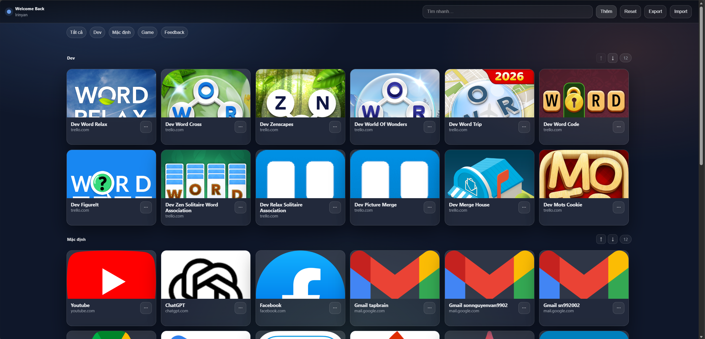

# 🧭 New Tab Dashboard

A clean, fast, and fully offline **New Tab Dashboard** for Chromium-based browsers.  
Designed for productivity with grouped links, drag & drop, and custom thumbnails — no server required.

---

## 📸 Screenshot



---

## ✨ Features

- Quick access links displayed as visual cards
- Groups with custom ordering (move up / down)
- Drag & drop to reorder links
- Custom thumbnails (local images or favicon fallback)
- Uniform card size for a clean layout
- Instant search across name, URL, and group
- Persistent storage using localStorage
- Dark UI optimized for daily use
- No server, no build step – runs directly from files
- Works as a New Tab browser extension

---

## 🚀 Installation (Developer Mode)

1. Download or clone this repository  
   Place it anywhere on your machine.

2. Open your browser and go to:  
   Settings → Extensions → Manage Extensions

3. Enable **Developer mode** (top right).

4. Click **Load unpacked**.

5. Select the repository folder.

Done! Open a new tab to see the dashboard.

---

## 📤 Export / Import Data

You can backup or transfer your dashboard data easily.

### Export
- Click **Export**
- A JSON backup file will be downloaded
- Includes:
  - All links
  - Group names & order
  - Metadata

### Import
- Click **Import**
- Select a previously exported JSON file
- Existing data will be replaced

⚠️ Import will overwrite current data.

---

## 📁 Project Structure
```
newtab-dashboard/
├── index.html # Main New Tab page
├── styles.css # Global styles & layout
├── app.js # Application logic
├── manifest.json # Extension configuration
├── thumbs/ # Local thumbnail images
│ ├── gmail.png
│ ├── notion.png
│ └── ...
├── icons/ # Extension icons
│ ├── icon16.png
│ ├── icon32.png
│ ├── icon48.png
│ └── icon128.png
└── screenshots/
└── dashboard.png
```

---

## 🧠 How It Works

- All links and settings are stored in browser `localStorage`
- Group order is stored separately to preserve layout
- No backend, no database, no external services required
- Clicking a card replaces the current tab (no new tab spam)

---

## 🛣 Roadmap

Planned improvements:

- [ ] Drag & drop between groups
- [ ] Collapse / expand groups
- [ ] Import / export configuration (JSON)
- [ ] Keyboard shortcuts
- [ ] Optional sync using browser storage
- [ ] Firefox support

---

## ❓ FAQ

**Q: Does this require a server or hosting?**  
A: No. Everything runs locally in the browser.

**Q: Where is my data stored?**  
A: In the browser’s `localStorage`.

**Q: Can I use local images as thumbnails?**  
A: Yes. You can reference files in the `thumbs/` folder or use image data URLs.

**Q: Can the New Tab page have a favicon?**  
A: No. Chrome does not support favicons for overridden New Tab pages.

**Q: Will this slow down my browser?**  
A: No. The dashboard is lightweight and only loads when opening a new tab.

---

## 🧩 Browser Compatibility

- Chrome
- Edge
- Brave
- Firefox (requires adjustments)

---

## 📜 License

MIT License — free to use, modify, and distribute.
